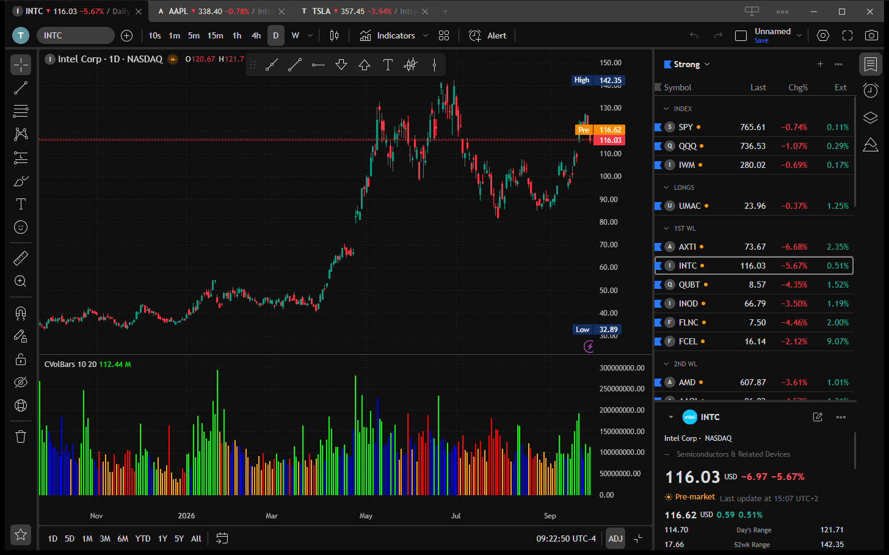

<p align="center">
  
</p>

# OpenTrader

**An attempt at an open trading app.** OpenTrader is a free, open-source desktop charting application built for speed. It is an open-source alternative to commercial trading software, out in the open for anyone to read, run, and extend.

It is an early work in progress: some features are stubbed or partially wired. Contributions, issues, and ideas are welcome.



> **Disclaimer:** OpenTrader is an independent project, not affiliated with any commercial trading platform or data provider. It is for charting and research only and is **not financial advice**. Provided "as is", without warranty. See [LICENSE](LICENSE).

## Download

Download the installer for your system and run it. Nothing else to set up: no account, no API key, no token. Market data works out of the box.

| OS | Download |
|---|---|
| Windows | [Installer (.exe)](https://github.com/deepentropy/opentrader/releases/latest/download/OpenTrader_windows_x64-setup.exe) or [.msi](https://github.com/deepentropy/opentrader/releases/latest/download/OpenTrader_windows_x64.msi) |
| macOS (Intel and Apple Silicon) | [Disk image (.dmg)](https://github.com/deepentropy/opentrader/releases/latest/download/OpenTrader_darwin_universal.dmg) |
| Linux | [.AppImage](https://github.com/deepentropy/opentrader/releases/latest/download/OpenTrader_linux_amd64.AppImage), [.deb](https://github.com/deepentropy/opentrader/releases/latest/download/OpenTrader_linux_amd64.deb) or [.rpm](https://github.com/deepentropy/opentrader/releases/latest/download/OpenTrader_linux_x86_64.rpm) |

All versions and release notes: [GitHub Releases](https://github.com/deepentropy/opentrader/releases).

The installers are not signed with a paid certificate:

- **Windows:** SmartScreen may show "Windows protected your PC". Click *More info*, then *Run anyway*.
- **macOS:** the app is ad-hoc signed. On first launch macOS blocks it. Open *System Settings > Privacy & Security* and click *Open Anyway*.

Windows is the main development platform. The macOS and Linux builds are produced by the same code but are less tested.

## Build from source

### Prerequisites

- Rust stable: https://rustup.rs/
- Node.js 22 or newer (npm)
- Tauri system dependencies for your OS: https://v2.tauri.app/start/prerequisites/
  (Windows: MSVC Build Tools and WebView2; Linux: `libwebkit2gtk-4.1-dev` and friends; macOS: Xcode Command Line Tools)

### Get the code

The drawing core is read from a sibling folder, so clone both repositories side by side:

```bash
git clone https://github.com/deepentropy/opentrader.git
git clone https://github.com/deepentropy/lightweight-charts-drawing.git
cd opentrader
npm ci
```

### Market data token (source builds only)

The released installers already contain the gateway token. Only a build from source needs one: market data goes through the OpenTrader gateway, and the app token is compiled into the build. Copy `.env.example` to `.env` and set `OPENTRADER_GATEWAY_TOKEN`, or set it as an environment variable. A build without a token runs, but charts get no data. `.env` is gitignored: never commit it.

### Run and build

```bash
npm run tauri dev      # opens the app with hot reload
npm run tauri build -- --no-sign   # installers under src-tauri/target/release/bundle/
```

The first run is slow (cold Rust build, a few minutes). Later runs take seconds.

`--no-sign` skips the signing of the in-app update files, which needs the project's private key. A build without it runs normally.

`src/bindings.ts` is written on each debug run of the app. For a release build from a fresh clone, generate it first with `cargo test --lib export_bindings` in `src-tauri/`. Do not edit it by hand.

## Layout

```
src/                  frontend (window/, components/, data/, styles/, assets/)
src-tauri/            backend and app config
docs/assets/          README images
.github/workflows/    release build
```

## Release

1. Set the version in `src-tauri/tauri.conf.json`, `src-tauri/Cargo.toml` and `package.json`.
2. Commit, then push a matching tag: `git tag v0.1.0 && git push origin v0.1.0`.
3. The [Release workflow](.github/workflows/release.yml) builds Windows, macOS and Linux installers and attaches them to a draft release. Review the draft and publish it.
4. Installed apps (Windows and macOS) find the new version at their next start or within an hour, download it, and offer "Update the app". This starts only once the release is published.

The workflow needs the repository secrets `OPENTRADER_GATEWAY_TOKEN`, `TAURI_SIGNING_PRIVATE_KEY` and `TAURI_SIGNING_PRIVATE_KEY_PASSWORD` (update signing key; its public key is `plugins.updater.pubkey` in `src-tauri/tauri.conf.json`).

## Third-party notices

OpenTrader uses [TradingView Lightweight Charts™](https://github.com/tradingview/lightweight-charts), licensed under the Apache License 2.0:

> TradingView Lightweight Charts™  
> Copyright (с) 2025 TradingView, Inc. https://www.tradingview.com/

## License

[MIT](LICENSE)
